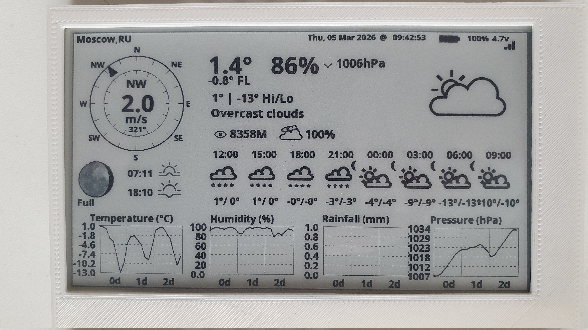
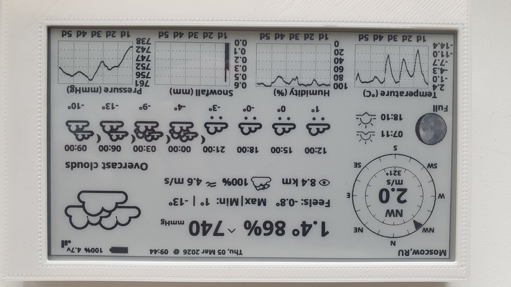

## This project is a modified fork of the original project by CybDis

ESP32 Weather Station for LilyGO T5 4.7" E-Paper (E-Ink) Display
=======================================

This project works with LilyGO T5 4.7 inch e-paper (E-Ink) EPD display and [OpenWeatherMap (OMW)](https://home.openweathermap.org) as ESP32 weather display.

### Screen Comparison (same weather data)

| Original Firmware                                               | Modified Version                                                   |
| --------------------------------------------------------------- | ------------------------------------------------------------------ |
|  Original version |  My modified version |

## Key Features & Improvements

This repository is a fork of:
https://github.com/CybDis/Lilygo-T5-4.7-WeatherStation-with-HomeAssistant

Changes made in this fork:

- Added wind gust display with a dynamic icon (scale: 0–5–10–15+ m/s)
- Added a dynamic cloudiness icon (scale: 0–10–30–60–85–100%).
- Added the ability to display atmospheric pressure in mmHg (in user_settings.h)
- Fixed snowfall chart (not working in the original firmware in my case). See Screen Comparison
- Fixed some weather icons (for example, "Overcast Clouds" previously showed a sun icon; now it displays correctly as overcast). See Screen Comparison
- Reworked weather icons and added some new icons
- For precipitation three icon levels are used:
  - light precipitation – 2 icons for rain, snow, drizzle, or thunderstorm
  - moderate precipitation – 3 icons for rain, snow, drizzle, or thunderstorm
  - heavy precipitation – 4 icons for rain, snow, drizzle, or thunderstorm
- Modified precipitation chart: if both snow and rain are present in the forecast, the chart displays light bars for snow and black bars for rain (if only snow or only rain is present, all bars are black)
- Default: 5-day forecast displayed in charts
- Default: data updates every 30 minutes
- Minor UI adjustments

## Compiling and flashing

To compile you will need following libraries.
- https://github.com/Xinyuan-LilyGO/LilyGo-EPD47
- https://github.com/bblanchon/ArduinoJson  

## Quick Flash Instructions

1. Download the firmware ZIP and extract it to a folder.
2. Connect the LilyGO T5 4.7" to your PC via USB.
3. Open main folder of this project in **Visual Studio Code** with the **PlatformIO** extension installed.
4. Open src/user_settings.h in Visual Studio Code, enter or update your WiFi credentials, OpenWeatherMap API key, location, and other settings, then save the file.
6. Press **Build** (checkmark icon) to compile the firmware.
7. Press **Upload** (right arrow icon) to flash the device.
8. Wait for the upload to finish and the device will start automatically.

# License

[GNU GENERAL PUBLIC LICENSE](./LICENSE)

## History & Credits
- Forked from [CybDis/Lilygo-T5-4.7-WeatherStation-with-HomeAssistant](https://github.com/CybDis/Lilygo-T5-4.7-WeatherStation-with-HomeAssistant)
- Based on [DzikuVx/LilyGo-EPD-4-7-OWM-Weather-Display](https://github.com/DzikuVx/LilyGo-EPD-4-7-OWM-Weather-Display)
- Original concept and code by [G6EJD](https://github.com/G6EJD/)
- Licensed under GPLv3 due to the required use of the GPLv3 LilyGo-EPD47 library. Full attribution to all prior authors is maintained.
