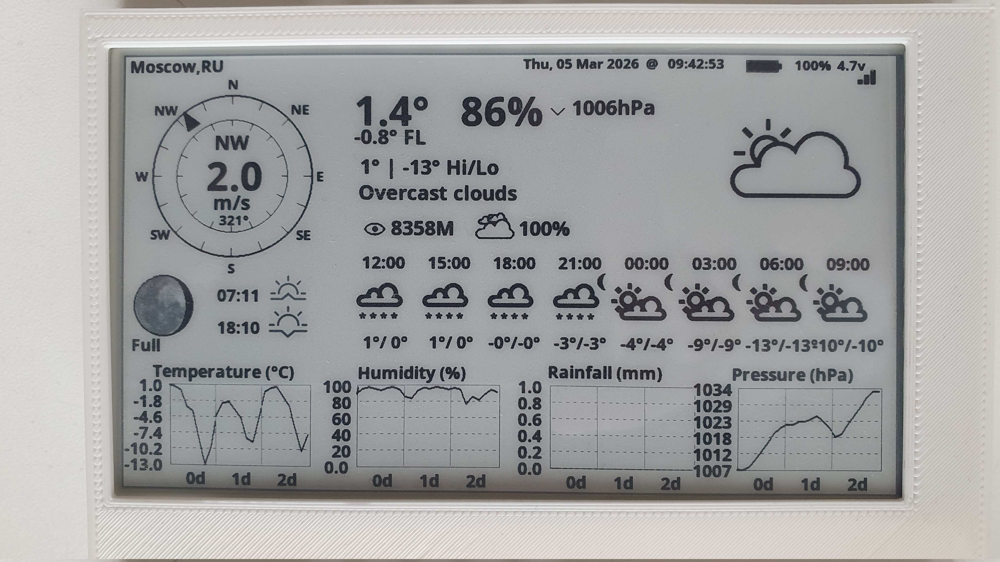
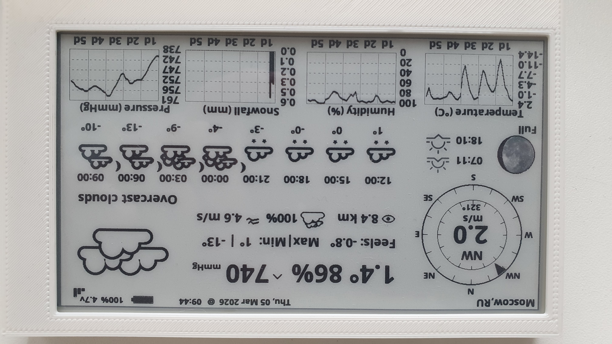
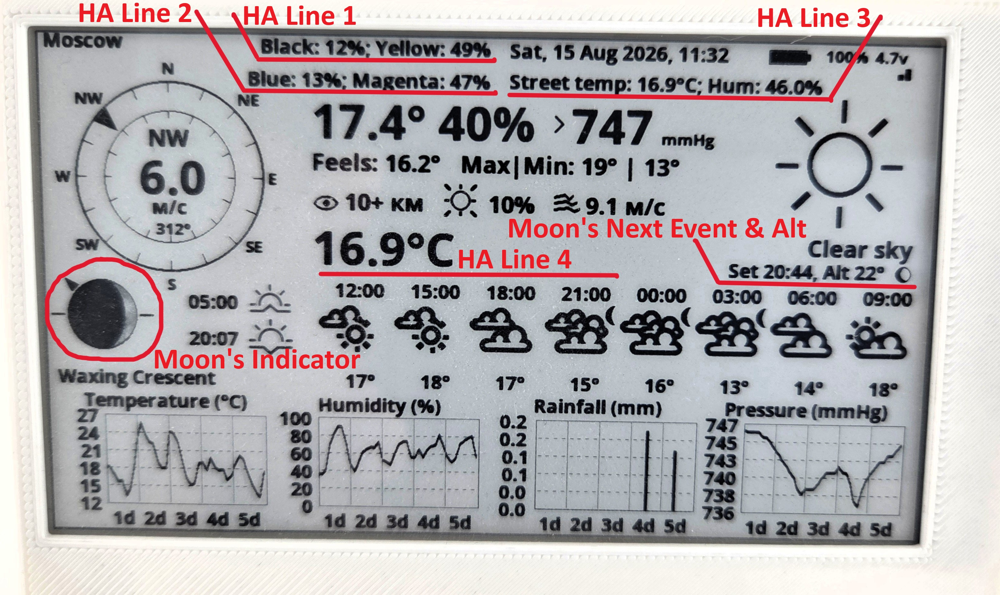
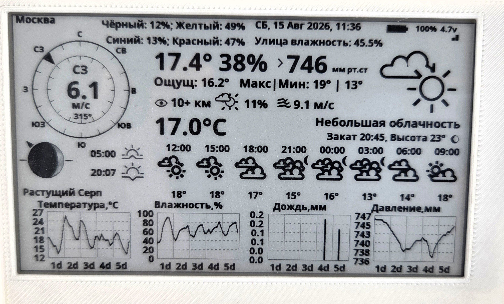

## This project is a modified fork of the original project by CybDis

ESP32 Weather Station for LilyGO T5 4.7" E-Paper (E-Ink) Display
=======================================

This project works with LilyGO T5 4.7 inch e-paper (E-Ink) EPD display and [OpenWeatherMap (OMW)](https://home.openweathermap.org) as ESP32 weather display.

### Screen Comparison (same weather data)

| Original Firmware                                               | Modified Version                                                   |
| --------------------------------------------------------------- | ------------------------------------------------------------------ |
|  Original version |  My modified version |

## ⚠️ Note
This code has not been fully tested and may contain bugs or unexpected behavior. Use it at your own risk.

## Key Features & Improvements

This repository is a fork of:
https://github.com/CybDis/Lilygo-T5-4.7-WeatherStation-with-HomeAssistant

Changes made in this fork:

- Added wind gust display with a dynamic icon (scale: 0–5–10–15+ m/s)
- Added a dynamic cloudiness icon (scale: 0–10–30–60–85–100%).
- Added the ability to display atmospheric pressure in mmHg (in user_settings.h)
- Fixed snowfall chart (not working in the original firmware in my case). See Screen Comparison
- Fixed some weather icons (for example, "Overcast Clouds" previously showed a sun icon; now it displays correctly as overcast). See Screen Comparison
- Reworked weather icons and added some new icons
- For precipitation three icon levels are used:
  - light precipitation – 2 icons for rain, snow, drizzle, or thunderstorm
  - moderate precipitation – 3 icons for rain, snow, drizzle, or thunderstorm
  - heavy precipitation – 4 icons for rain, snow, drizzle, or thunderstorm
- Modified precipitation chart: if both snow and rain are present in the forecast, the chart displays light bars for snow and black bars for rain (if only snow or only rain is present, all bars are black)
- Default: 5-day forecast displayed in charts
- Default: data updates every 30 minutes
- Minor UI adjustments

## Changelog

### 12.08.2026

* Added a **Moon position indicator** showing whether the Moon is above or below the horizon. See the image below. If the indicator does not work correctly in your case, it can be disabled in `user_settings.h` by setting: `ShowMoonPosition = 0`
* Added a **Moon event line** showing the time of the next Moon horizon crossing (rise or set) and the Moon's altitude (alt) above or below the horizon. See the image below. This information can be configured in `user_settings.h` using the following settings: `ShowMoonEventSection = 0` disables the display of the time of the next Moon horizon crossing; `ShowMoonLatVisible = 0` disables the display of the Moon's altitude. If `ShowMoonLatVisible = 1`, you can also choose not to display the Moon's altitude when the Moon is below the horizon by setting: `ShowMoonLatInvisible = 0`
* Added support for displaying information from **Home Assistant** on the display. Data from up to 7 sensors can be displayed across 4 lines, with 1 or 2 sensors per line. The feature can be enabled and each sensor can be configured in `user_settings.h`. It is disabled by default. To connect to Home Assistant, you need to create a Long-Lived Access Token: Profile → Long-Lived Access Tokens → Create Token
* Added support for displaying data in **Cyrillic**. Note: If you make any changes to the code, keep in mind that Cyrillic characters are available only in the 8, 10, and 12 font sizes. The 18 and 24 fonts do not include Cyrillic characters. For full Russian language support, select `#include "lang_ru.h"`, set: `String Language = "ru";` and set: `Units = "R"` in user_settings.h
* **ESP32-S3** support: Added changes intended to support the newer LilyGO ESP32-S3 boards (with 3 buttons). It is unclear whether the original firmware supported these boards. This change has not been tested, as I don't have an ESP32-S3 board available.

### Changelog and Russian translate

| Changelog                                                       | Russian translate                                                  |
| --------------------------------------------------------------- | ------------------------------------------------------------------ |
|  English version |  Russian version |

## Compiling and flashing

To compile you will need following libraries.
- https://github.com/Xinyuan-LilyGO/LilyGo-EPD47
- https://github.com/bblanchon/ArduinoJson  

## Quick Flash Instructions

1. Download the firmware ZIP and extract it to a folder.
2. Connect the LilyGO T5 4.7" to your PC via USB.
3. Open main folder of this project in **Visual Studio Code** with the **PlatformIO** extension installed.
4. Open src/user_settings.h in Visual Studio Code, enter or update your WiFi credentials, OpenWeatherMap API key, location, and other settings, then save the file.
5. Check the language file selected in user_settings.h (e.g., lang.h (English), lang_de.h, lang_fr.h or lang_ru.h in the src folder) and adjust the translation if necessary.
6. If needed, open src/OWM_EPD47.ino in Visual Studio Code and modify the weather update schedule in lines 50-55 (by default, the weather is updated every 30 minutes, and the device enters sleep mode daily from 03:00 to 06:00)
7. Open platformio.ini file, find the `default_envs` line and specify which LilyGO board you are using: set `esp32` — for the older board (with 5 buttons), set `esp32s3` — for the newer board (with 3 buttons). I don't have the newer LilyGO ESP32-S3 version, so this configuration has not been tested. Use it at your own risk. Note: esp32 (old version) is selected by default.
8. Press **Build** (checkmark icon) to compile the firmware.
9. Press **Upload** (right arrow icon) to flash the device.
10. Wait for the upload to finish and the device will start automatically.

# License

[GNU GENERAL PUBLIC LICENSE](./LICENSE)

## History & Credits
- Forked from [CybDis/Lilygo-T5-4.7-WeatherStation-with-HomeAssistant](https://github.com/CybDis/Lilygo-T5-4.7-WeatherStation-with-HomeAssistant)
- Based on [DzikuVx/LilyGo-EPD-4-7-OWM-Weather-Display](https://github.com/DzikuVx/LilyGo-EPD-4-7-OWM-Weather-Display)
- Original concept and code by [G6EJD](https://github.com/G6EJD/)
- Licensed under GPLv3 due to the required use of the GPLv3 LilyGo-EPD47 library. Full attribution to all prior authors is maintained.
